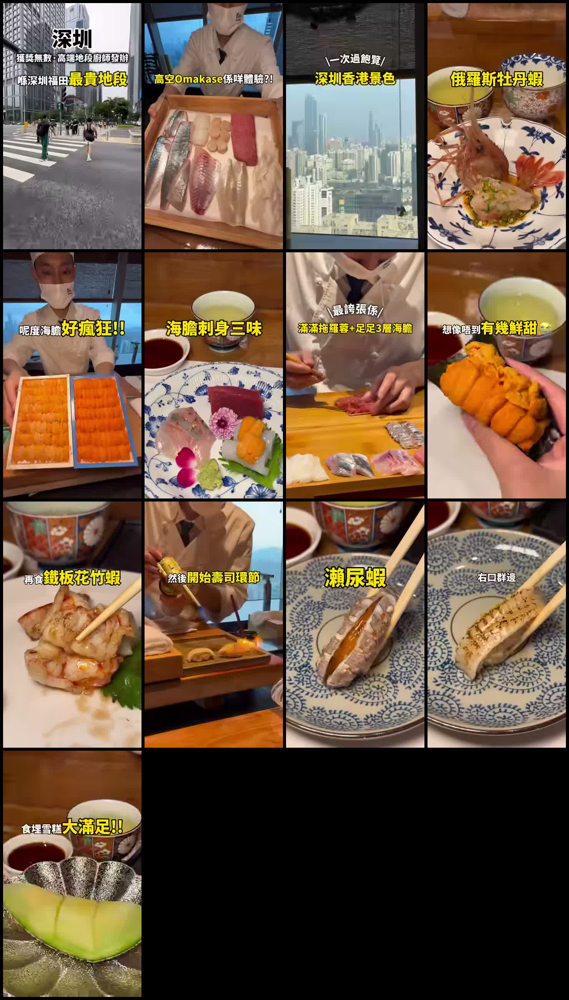
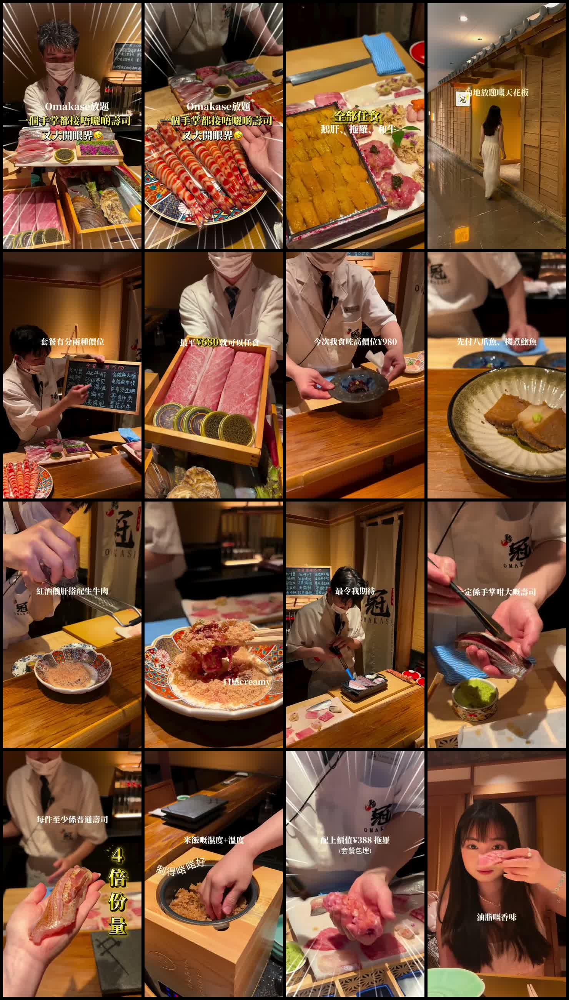
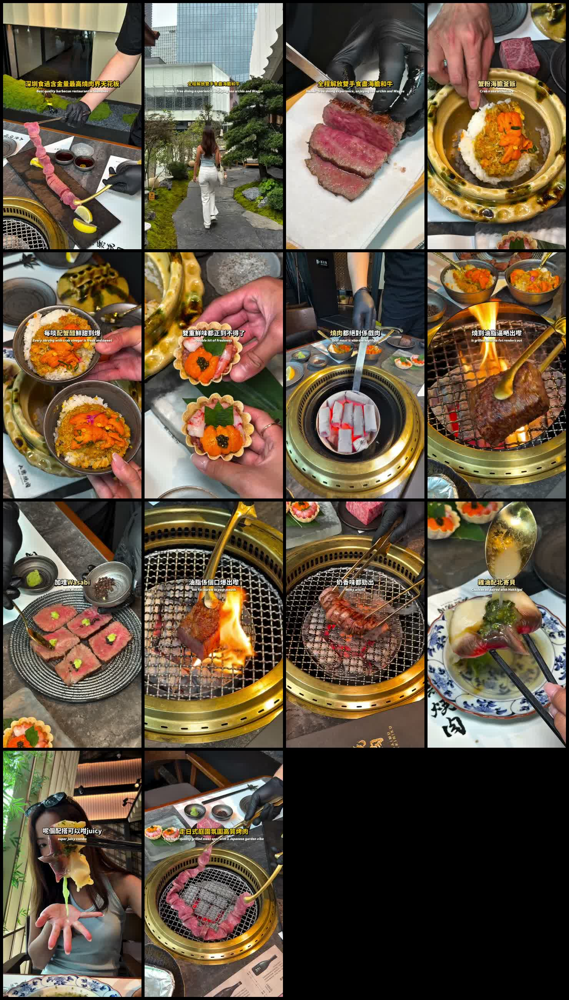
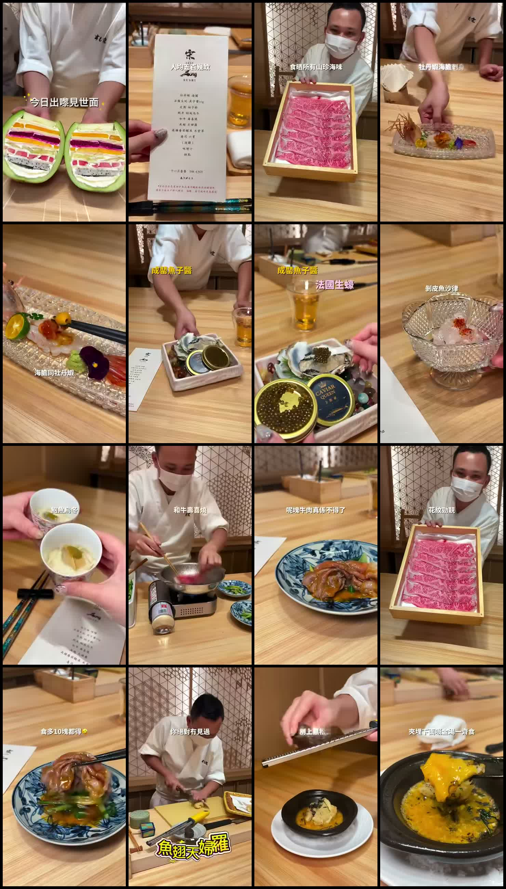
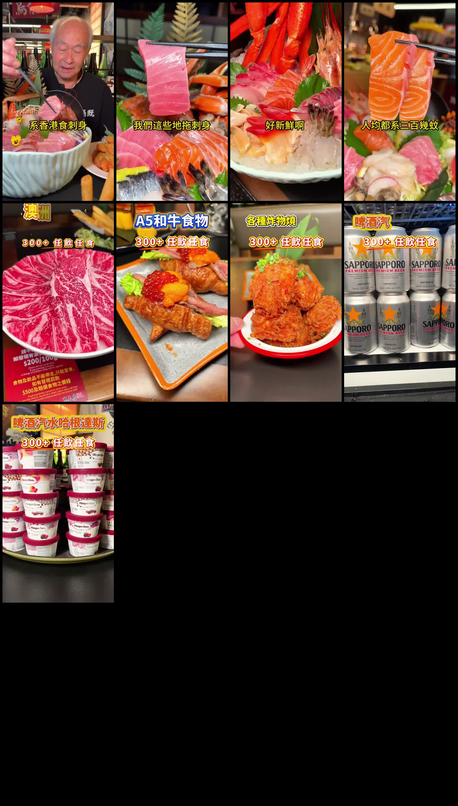
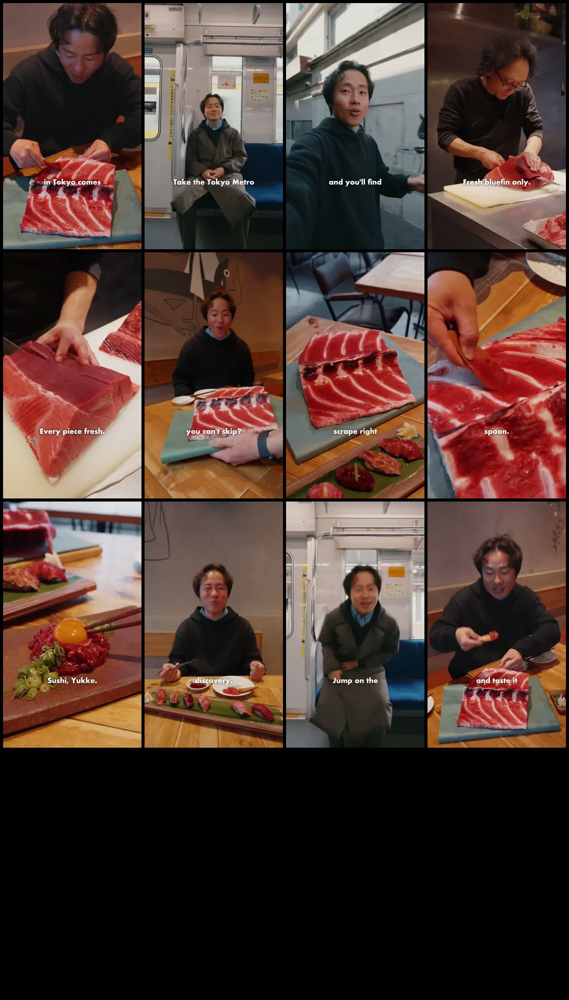
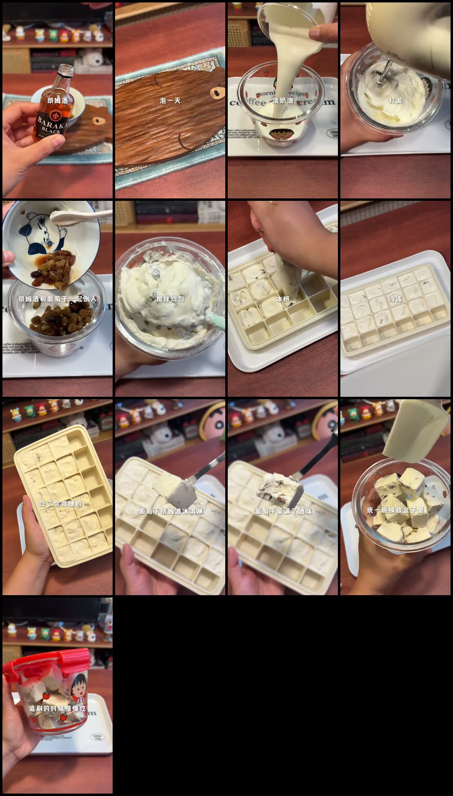

# POI Wiki Index

This page groups the analyzed points of interest by geography. Each item links to the full analysis and shows the generated contact sheet from the downloaded video.

## Shenzhen, China

### Futian

#### [Yingu Omakase / 隐谷Omakase](1700298280-fb.watch/analysis.md)

- Area: Futian / Gangxia / Convention and Exhibition Center area
- Address: Room 41B, Fortune Building, 88 Fuhua 3rd Road, Gangxia Community, Futian Subdistrict, Shenzhen
- Genre: high-rise Japanese omakase / sushi and sashimi counter
- Price point: premium; roughly ¥301+ to about ¥634 average from lookup signals
- Reservations: recommended
- Gist: A 41st-floor omakase built around skyline views over Shenzhen and Hong Kong, seafood-heavy courses, and a dramatic sea-urchin/toro sequence. The post highlights Russian botan shrimp, scallop hand roll, teppan prawn, chawanmushi, sea urchin crab cup, sea urchin sashimi trio, toro mince with three layers of sea urchin, bluefin tuna sushi, wild honey tamagoyaki, and fruit ice cream.
- Source posts: [1700298280](1700298280-fb.watch/analysis.md), [1700297979](1700297979-fb.watch/analysis.md)

#### [鮨冠 OMAKASE食べ放題](1700305381-facebook.com/analysis.md)

- Area: Futian / Xiangmihu
- Address: Room 203, 2F, Hengbang Zhidi Building, 3089 Qiaoxiang Road, Xiangmihu Subdistrict, Futian, Shenzhen
- Genre: Japanese omakase-style sushi all-you-can-eat / sushi buffet
- Price point: ¥680 and ¥980 tiers
- Reservations: needed or strongly recommended; the post lists phone/WeChat 13352907120 and asks viewers to comment for booking details
- Gist: A spectacle-driven sushi buffet/omakase clip centered on giant hand-size sushi, counter-made freshness, and a ¥980 upgrade that offers either 15 limited sushi pieces or 8 oversized sushi pieces. The video sells it as a high-impact, photo-friendly Shenzhen dining experience.

### Nanshan / Houhai

#### [Dawu Yakiniku / 大無燒肉](1700494133-facebook.com/analysis.md)

- Area: Nanshan / Houhai
- Address: Unit CL310, L3, Area C, Shenzhen Bay MixC, 1218 Haide 1st Road, Yuehai Subdistrict, Nanshan, Shenzhen
- Genre: Japanese yakiniku / premium wagyu grill
- Price point: premium; OpenRice categorizes it as ¥301+, with an Apple Maps lookup around ¥676 average
- Reservations: needed or strongly recommended; the post asks viewers to comment “yum” for booking details
- Gist: A premium yakiniku reel focused on hands-free grilling, wagyu richness, and seafood-wagyu combinations. The strongest hooks are crab roe and sea urchin kamameshi, sea urchin sweet shrimp tart, cubed wagyu, wagyu tongue, chicken oil with hokki clam, and a refined Japanese garden atmosphere.

#### [Sushi Song / 壽司宋 SUSHI SONG](1700301715-facebook.com/analysis.md)

- Area: Nanshan / Houhai
- Address: Shop 149, 1F, Coastal City Shopping Center, Wenxin 4th Road, Nanshan, Shenzhen
- Genre: high-end Japanese omakase / sushi counter
- Price point: ¥500-plus per person according to the post
- Reservations: strongly recommended; the post says there are only 12 counter seats
- Gist: A luxury but comparatively accessible Shenzhen omakase reel built around 65-70g palm-size sushi and rare ingredients. The course impression includes botan shrimp, sea urchin sashimi, caviar, abalone udon, wagyu sukiyaki, fish-bone tempura, black truffle, flower-maw soup, giant hand-held sushi, large shellfish, sea urchin hand roll, and layered dessert.

## Hong Kong

### Tsim Sha Tsui, Kowloon

#### [Black Wood Izakaya / 黑木亭居酒屋](1701182518-facebook.com/analysis.md)

- Address: G/F-1/F, Kok Pah Mansion, 58-60 Cameron Road, Tsim Sha Tsui, Hong Kong
- Genre: Japanese izakaya, sushi/sashimi, all-you-can-eat sashimi set
- Price point: HK$300-plus per person for 4 hours according to the post; OpenRice lists HK$201-400
- Reservations: recommended
- Gist: A value-focused Tsim Sha Tsui izakaya/sashimi clip. The core claim is that sashimi in Hong Kong can be fresh and generous without being extremely expensive, with whole fish brought in, thick cuts, and a four-hour dining window.

## Tokyo, Japan

### Nakano

#### [Maguro Mart / マグロマート](1700372224-fb.watch/analysis.md)

- Address: 1F/2F, 5-50-3 Nakano, Nakano-ku, Tokyo 164-0001, Japan
- Genre: tuna-specialty seafood izakaya; sushi/sashimi/tuna dishes
- Price point: TableCheck lists tuna courses around ¥3,580-¥4,280 before tax; dinner varies by course/order
- Reservations: recommended and likely needed at peak times
- Gist: A tuna-specialty Tokyo izakaya near Nakano Station. The hook is nakaochi, where tuna meat is scraped from the spine and served with a spoon, plus bluefin tuna prepared as sashimi, sushi, yukke, and bento/takeout.

## Unknown / Not Enough POI Evidence

#### [Alcohol-Infused Adult Ice Cream / 微醺大人冰淇淋](1700490320-xiaohongshu.com/analysis.md)

- City: unknown from available post data
- Address: unknown
- Genre: dessert / homemade alcohol-infused ice cream concept
- Price point: unknown
- Reservations: not applicable unless the original Xiaohongshu post identifies a shop
- Gist: This appears to be a recipe/process clip rather than a restaurant POI. The visible text shows a rum-raisin ice cream process: soak raisins in rum, whip cream, mix in rum raisins, freeze in an ice-cube tray, unmold into a container, and eat slowly while watching shows because it gives a light buzz.

## Failed Analysis

#### [Facebook reel 942918698565091](1700428438-facebook.com/analysis.md)

- Source: `https://www.facebook.com/reel/942918698565091/?fs=e&mibextid=wwXIfr&fs=e`
- Status: `yt-dlp` could not parse the post, so there is no reliable video/audio/contact-sheet analysis yet.
